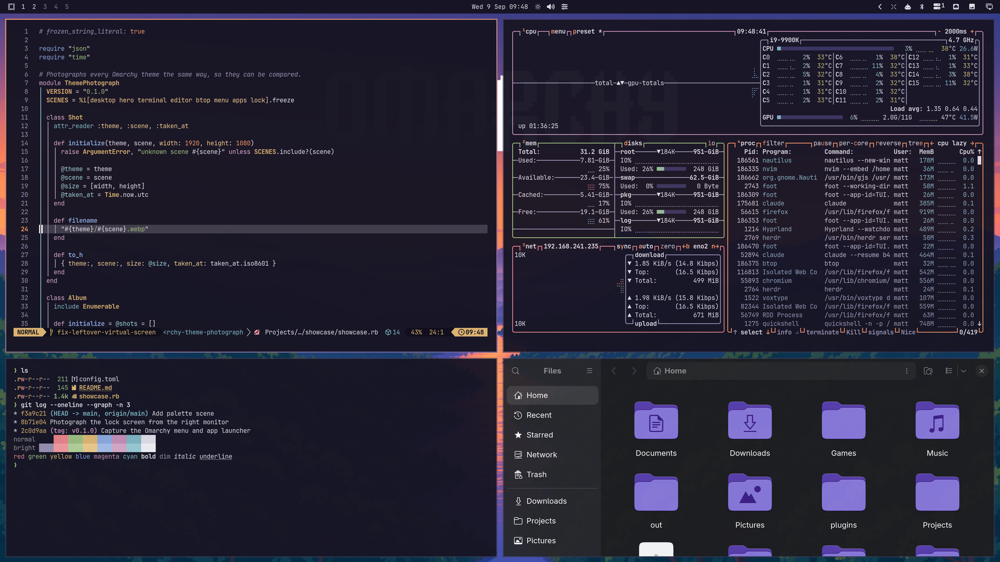
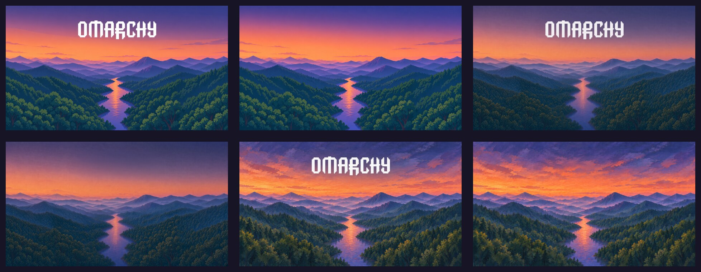
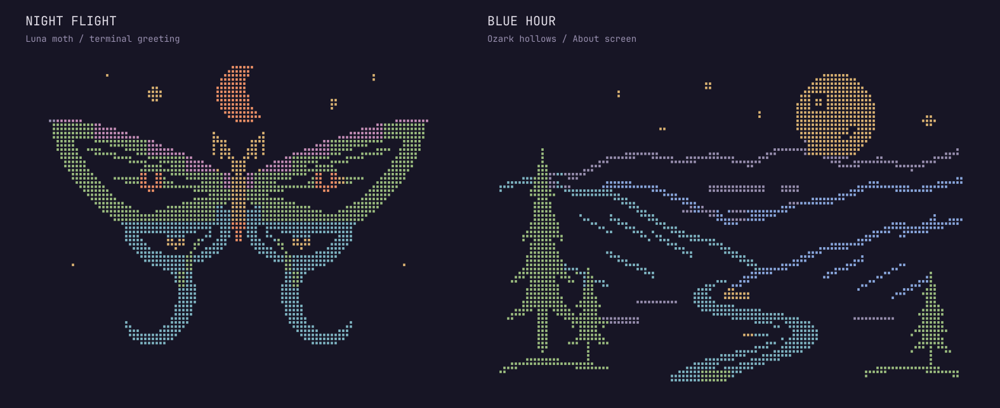
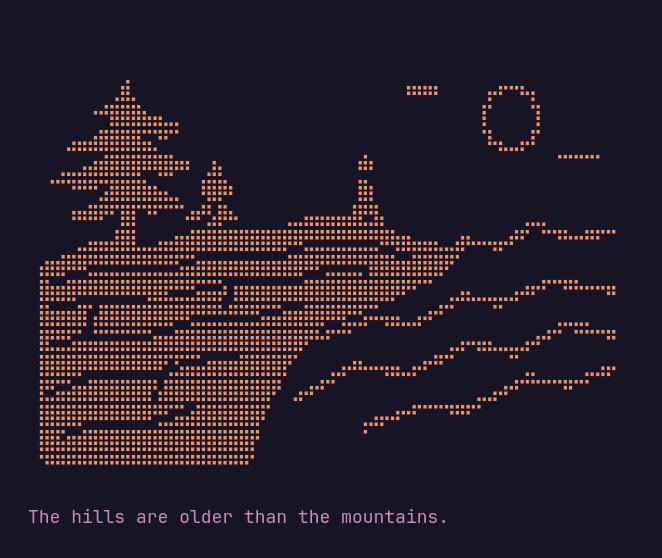
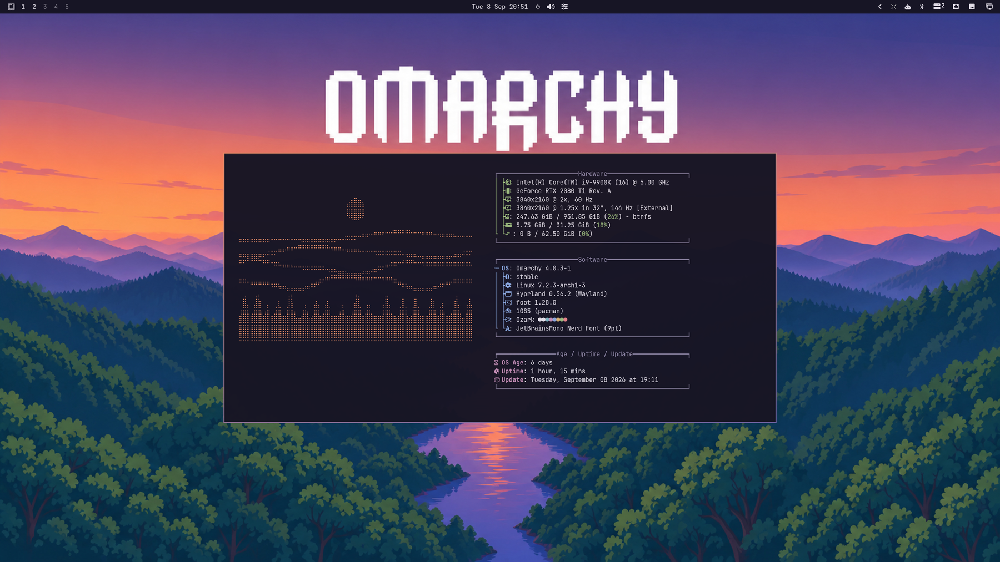
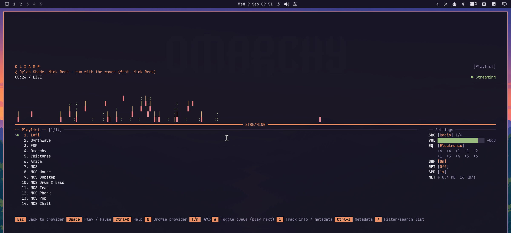

# 🏔️ Ozark

An [Omarchy](https://omarchy.org) theme named for the Ozark mountains in
Northwest Arkansas. Indigo dusk, a coral sunset band, hazy blue ridges, and
teal-and-olive forest. Dark first, readable always.



## ✨ What you get

- **Palette** pulled from a dusk photograph of the Boston Mountains: a deep
  indigo-charcoal background, coral sunset accent, and secondaries taken from
  the ridge haze and the forest canopy. Every colour clears its contrast
  target on every background — body text sits near 13:1, and `muted`, the grey
  used for code comments, holds at 5.9:1 instead of the usual 3-ish.
- **Everything themed at once**: terminals (foot, Alacritty, Kitty, Ghostty),
  Neovim, btop, Helix, the Omarchy bar, launcher, notifications, lock screen,
  Chromium, VS Code, Obsidian, Claude Code, and the keyboard backlight.
- **Window borders** fade from sunset coral into ridge violet.
- **Eight 4K wallpapers**: cell-shaded mountains, brush-painted mountains,
  a moonlit bluff blockprint, and an abstract contour map, each with and
  without the Omarchy wordmark.
- **Optional extras**: a luna moth in colored Braille greeting you in every new
  terminal, moonlit Ozark hollows on the About screen, and a matching theme for
  the cliamp music player.

## 📦 Install

```bash
omarchy theme install https://github.com/itsMattGuenther/omarchy-ozark-theme.git
```

The theme is applied right away. Later, switch with:

```bash
omarchy theme set ozark
omarchy theme bg next        # cycle wallpapers
```

## 🎨 Wallpapers



Eight variants live in `backgrounds/`, all exported at 3840x2160. Each design
has an Omarchy wordmark version followed by a version without lettering.

They sort by filename, so the numbered prefixes decide the order
`omarchy theme bg next` walks. Add your own next to them, or drop
extra images into `~/.config/omarchy/backgrounds/ozark/` to keep them out of
the theme folder.

## 🖼️ The art



Two original pieces of colored Braille art, drawn as vectors for the terminal's
small dot grid. Broad silhouettes, open wing veins, and separate colors for the
landscape layers bring the Ozarks into the terminal after dark.

**Night Flight** — a luna moth with sweeping green wings, copper eyespots,
blue ribbon tails, and a crescent overhead — greets you in every new terminal.
Stay a little wild.



**Blue Hour** — a golden moon above receding Ozark ridges, green cedars, and
a bright river curling through the hollow — takes over the About screen:



Both live in `extras/art/` as plain text and ANSI color text, with editable SVGs
and a reproducible converter next to them. The greeting is 56 columns by 18
rows; About is 64 columns by 20 rows. About uses short terminal palette codes
to keep Omarchy's window measurement compact. The artwork preview renders the
actual color text files; the greeting and About images are desktop captures.
Set `NO_COLOR=1` for a monochrome greeting.

## 🎵 cliamp



A matching theme for the [cliamp](https://github.com/omacom-io/cliamp) music
player. The theme hook switches cliamp to it while Ozark is active and puts
your previous cliamp theme back when you switch away.

## 🔐 The lock screen

The lock screen (Super+Escape) shows a blurred copy of whichever wallpaper you
are on, with the theme's colours on the password box. That is how Omarchy
builds it, and no theme can put its own artwork there.

## 👾 Extras (optional)

Omarchy cannot install the art, the greeting or the cliamp theme from a theme
repo, so there is a one-shot script:

```bash
~/.config/omarchy/themes/ozark/extras/install.sh
```

What it changes:

- copies files into `~/.config/ozark/` and `~/.config/cliamp/themes/`
- adds one marked block at the end of `~/.bashrc` (a backup is kept as
  `.bashrc.bak.ozark`)
- installs a theme hook, `ozark-theme-set.sh`, that switches cliamp and the
  About logo whenever this theme is active, and puts both back when you pick
  another theme

The hook is named after the theme rather than `theme-set.sh`, so it sits
alongside other themes' hooks instead of overwriting them.

The greeting and the About art only show while this theme is the active one,
so other themes are left alone.

To remove all of it:

```bash
~/.config/omarchy/themes/ozark/extras/install.sh --uninstall
```

## 🛠️ Hacking on it

- `colors.toml` is the whole palette. Everything else is generated from it.
- The wallpapers were upscaled to 4K with a Mitchell resample and a light
  unsharp pass; if you re-render the sources at native 4K they will be sharper
  than any upscale.
- The Braille art is generated from `extras/art/*.svg`. Edit the vectors, then
  run `python3 extras/art/render.py` (requires Python 3.11+ and ImageMagick).
  The converter preserves both pieces' terminal dimensions and generates
  plain and ANSI text. `python3 extras/art/preview.py` rebuilds the artwork
  comparison using JetBrainsMono Nerd Font.

## 🙏 Credits

- Wallpapers and Braille art are original work for this theme.
- Built on Omarchy's theme system by DHH and the Omarchy community.

## 🤝 Contributing

I'd gladly take help from anyone who wants to iterate on this: native 4K
wallpaper renders, better art, palette tweaks, new extras, anything. Open an
issue or a pull request. I'm here for the community <3

## ⚖️ License

MIT, see `LICENSE`.
